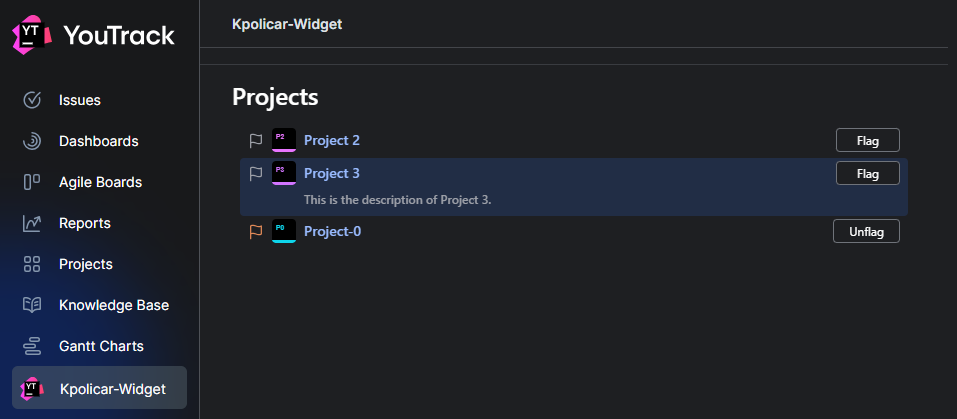

# Building a Sync Engine for YouTrack

This project has been spun off the [YouTrack App Quick Start](https://www.jetbrains.com/help/youtrack/devportal/apps-quick-start-guide.html) and was developed as part of the JetBrains internship project: [Building a Sync Engine for YouTrack
](https://internship.jetbrains.com/projects/1631).

Similar solution to internship problem description for OctoberCMS: https://github.com/kpolicar/octobercms-backendtrafficcop

## Run the demo environment

To run the demo environment:

```bash
docker compose up -d
```

## Live Demo

This project is temporarily hosted on a 2vCPU 4GB RAM Hetzner VM. You can access the Grafana dashboard at: [http://91.98.203.183:8080](http://91.98.203.183:8080) The login credentials are `admin:admin`.



## Project Enhancements
- Created a new widget with a backend that stores flagged project IDs in memory.
- Added a dedicated page accessible via the main menu.
- Page lists all projects scoped to the authenticated user.
- Included a button for each project to "flag" or "unflag" it.

## Attempted Enhancements / Notes
- Explored using YouTrack entity and global extension properties.
- Unable to implement due to unclear API documentation and time constraints.
